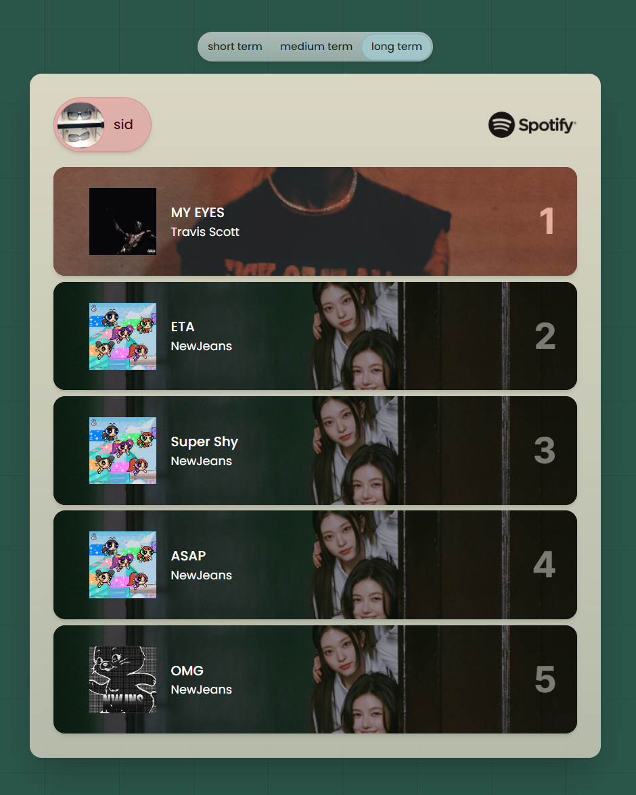
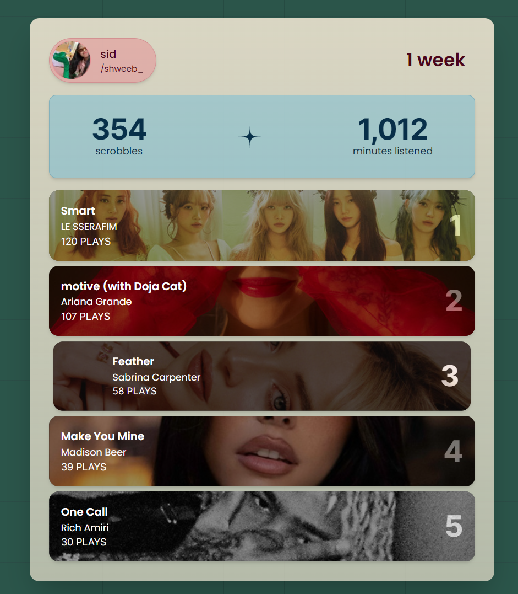

## Overview

View a clean, aesthetic overview of your recent music trends.




## Features

- Last.fm support
- Spotify support (limited because I'm currently in the process of applying for quota extension for their API use)

## Stack


## Getting started

You can either use this project on it's [WEBSITE](https://example.com) or by spinning up your own server.

### Prerequisites

- [Node.js](https://nodejs.org/)
- [npm](https://www.npmjs.com/)

### Installation

Clone the repository

```shell
git clone git@github.com:sidsurakanti/taste-card.git
```

Navigate to the project directory

```shell
cd taste-card
```

Install dependencies

```shell
npm install
```

Create a new .env.local file and populate it as such

```bash
# you can get one @ https://www.last.fm/api/account/create
LAST_FM_API_KEY="CHANGE THIS"
# see: https://developer.spotify.com/documentation/web-api/concepts/apps
SPOTIFY_CLIENT_ID="CHANGE THIS"
SPOTIFY_CLIENT_SECRET="CHANGE THIS"
# make sure to add this callback route when creating your spotify app
# change this if you are using a different callback route
SPOTIFY_REDIRECT_URI="http://localhost:3000/callback"
```

Start up the server

```shell
npm run dev
```

The app should now be live on `http://localhost:3000`.

## Contributing

Refer to [CONTRIBUTING.md](./docs/CONTRIBUTING.md)

## Roadmap

- [x] Clean up code
- [x] Write a better README
- [ ] Get Spotify API Quota Extension
- [ ] Add a new feature

## Support

If you need help with anything or want to request new features, you can reach me on [discord](https://discord.com/users/521872289231273994) 👍

## Acknowledgements

Thanks to everyone who assisted me on this project ❤️
